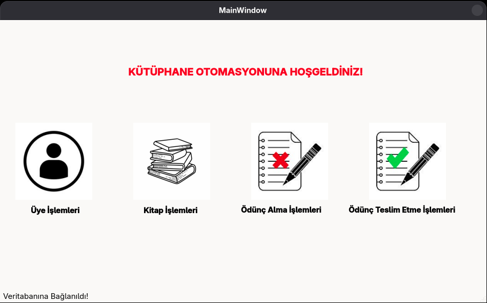
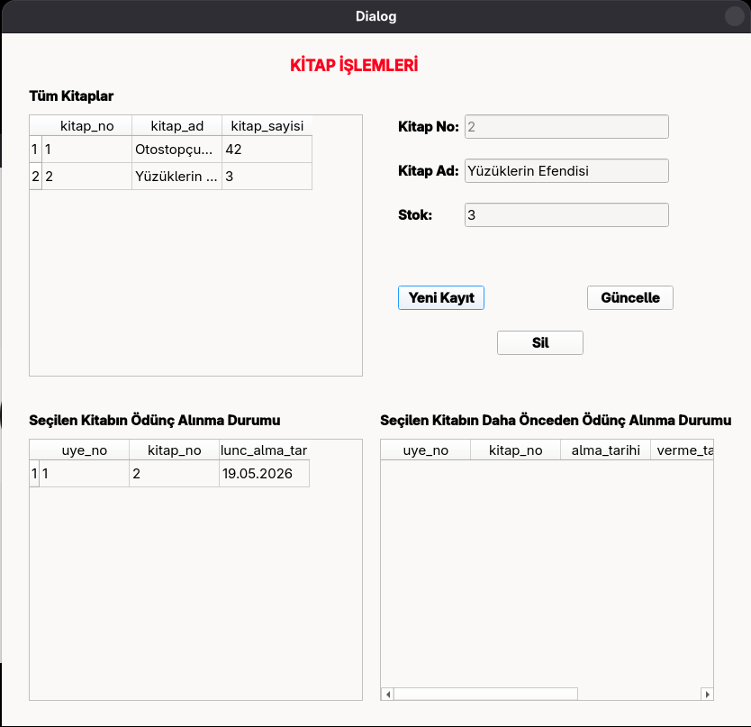

# Kütüphane Yönetim Sistemi

Qt5/6 ve SQLite kullanılarak geliştirilmiş, kullanıcı dostu arayüze sahip masaüstü kütüphane yönetim uygulaması.



## Özellikler

### Genel
- **Otomatik veri yenileme:** Tüm tablolar 6 saniyede bir güncellenir
- Kullanıcı dostu Qt arayüzü
- SQLite ile hafif ve hızlı veritabanı yönetimi

### Kitap Yönetimi
- Kitap ekleme, güncelleme ve silme işlemleri
- Stok takibi ve envanter yönetimi
- Anlık ödünç durumu görüntüleme
- Geçmiş ödünç alma kayıtlarına erişim

### Üye Yönetimi
- Üye kayıt sistemi (ad-soyad bazlı)
- Üye bilgilerini güncelleme
- Teslim edilmemiş kitabı olan üyelerin silinme koruması
- Tablo üzerinden hızlı üye seçimi

### Ödünç Alma Sistemi
- Kitap ödünç verme ve teslim alma işlemleri
- Tarih bazlı takip sistemi
- Gerçek zamanlı stok güncellemesi
- Ödünç alınan kitapların detaylı geçmiş kaydı

## Teknik Detaylar

### Kullanılan Teknolojiler
- **Framework:** Qt5/6
- **Veritabanı:** SQLite
- **Dil:** C++
- **Mimari:** MVC (Model-View-Controller)

### Veritabanı Yapısı

- `kitap` - Kitap bilgileri ve stok takibi
- `uye` - Üye kayıtları
- `odunc_alinan` - Aktif ödünç kayıtları
- `odunc_teslim_edilen` - Teslim edilmiş kayıtların geçmişi

---



---

## Kurulum

### Gereksinimler
- Qt5 (5.12+) veya Qt6
- SQLite3
- C++11 uyumlu derleyici (GCC/Clang/MSVC)

### Derleme

#### Linux (Fedora/Ubuntu)
```bash
# Gerekli paketleri yükle
sudo dnf install qt5-qtbase-devel sqlite-devel  # Fedora
sudo apt install qtbase5-dev libsqlite3-dev      # Ubuntu

# Projeyi derle
qmake
make
```

#### Windows (Qt Creator)
1. Qt Creator'da `.pro` dosyasını aç
2. Build > Build Project
3. Çalıştır

## Kullanım

### Kitap Ekleme
1. "Kitap İşlemleri" penceresini aç
2. Kitap adı ve stok miktarını gir
3. "Yeni Kayıt" butonuna tıkla

### Ödünç Verme
1. "Ödünç İşlemleri" penceresinden kitap ve üye seç
2. "Ödünç Ver" butonuna tıkla
3. Stok otomatik olarak azalır

### Teslim Alma
1. Ödünç listesinden ilgili kaydı seç
2. "Teslim Al" butonuna tıkla
3. Kayıt geçmiş tabloya taşınır ve stok güncellenir

## Güvenlik Özellikleri

- **Veri bütünlüğü:** Ödünç verilmiş kitaplar silinemez
- **Referans kontrolü:** Aktif kaydı olan üyeler silinemez
- **Parameterized queries:** SQL injection koruması
- **Otomatik validasyon:** Boş alan kontrolü
- **Atomic DB işlemleri:** Transaction desteği

## Mimari Notları

### QSqlTableModel Kullanımı
Veritabanı işlemleri için Qt'nin `QSqlTableModel` sınıfı kullanılarak CRUD operasyonları basitleştirilmiş ve UI ile veri senkronizasyonu otomatize edilmiştir.

### Timer Mekanizması
6 saniyede bir `QTimer` ile veri yenileme yapılarak çoklu kullanıcı senaryolarında anlık güncellemeler sağlanır.

### UI Organizasyonu
Her modül (Kitap, Üye, Ödünç) ayrı `QDialog` sınıfları ile yönetilir. Bu yapı kodun modüler ve sürdürülebilir olmasını sağlar.

## Lisans

Bu proje [MIT lisansı](LICENSE) altında lisanslanmıştır.

